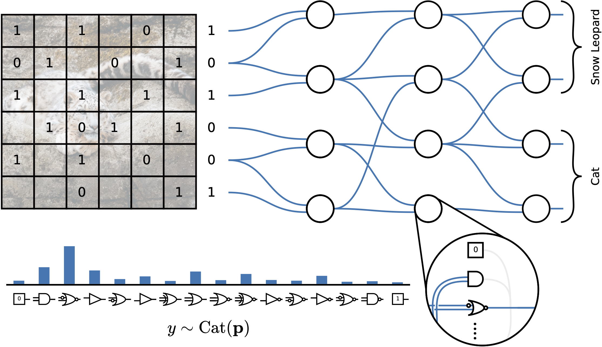

# Mind the Gap: Removing the Discretization Gap in Differentiable Logic Gate Networks

Official implementation of **Gumbel Logic Gate Networks (GLGNs)**, from our NeurIPS 2025 paper: _[Mind the Gap: Removing the Discretization Gap in Differentiable Logic Gate Networks](https://arxiv.org/pdf/2506.07500)_.





## 🔬  Running an Experiment

Experiments are configured using `.yaml` files.  
Here is an example configuration:

````yaml
experiment_name: "example_run"
dataset: "CIFAR10"
seed: 42
num_layers: 12
num_neurons: 256000
training_bit_count: 32
grad_factor: 1.0
gumbel_tau: 1.0
stochastic: "gumbel"
batch_size: 128
lr: 0.01
num_iterations: 10000000
tau: 100
save_final_model: true
save_model_per_eval: false
resume_checkpoint: null
````


## 🚀 Launching with Apptainer

We recommend using our provided Apptainer / Singularity container. From the project root, run:


````
apptainer exec --nv \
  --bind $(pwd) \
  container.sif \
  python main.py \
  --config example.yaml
````


Replace example.yaml with the path to your desired config file.


> ⚠️ Note: Running the code requires a compatible GPU setup and the Apptainer runtime installed on your system.
Ensure container.sif is present in the current directory or adjust the path accordingly. Inside container.sif you need to adjust **correct cuda version**, i.e. 'export TORCH_CUDA_ARCH_LIST="7.5"'


### 🛠️ Building the Container

To build the container locally:
1. Install [Apptainer](https://apptainer.org/docs/)
2. Build the container using
  ````
apptainer build container.sif container.def
````


## 📄 Citation

If you use this code, please cite our NeurIPS 2025 paper:

````
@inproceedings{
yousefi2025mind,
title={Mind the Gap: Removing the Discretization Gap in Differentiable Logic Gate Networks},
author={Shakir Yousefi and Andreas Plesner and Till Aczel and Roger Wattenhofer},
booktitle={The Thirty-ninth Annual Conference on Neural Information Processing Systems},
year={2025},
url={https://openreview.net/forum?id=chYXaetMmz}
}
````


## 💡 Acknowledgements

This repository is based on the [difflogic](https://github.com/Felix-Petersen/difflogic) codebase and the methods introduced in [Petersen et al. (2022)](https://arxiv.org/pdf/2210.08277). We thank the authors for making their implementation publicly available.